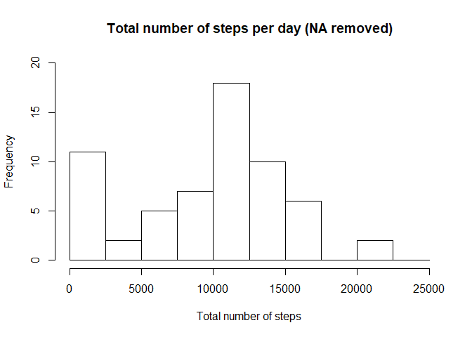
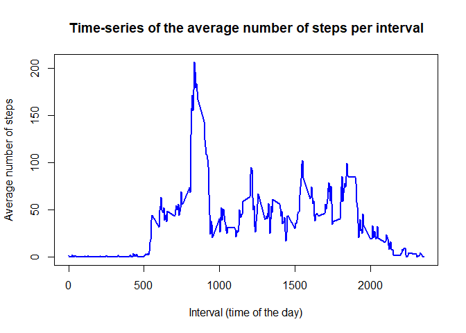
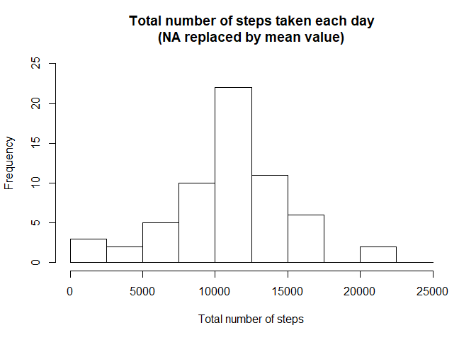
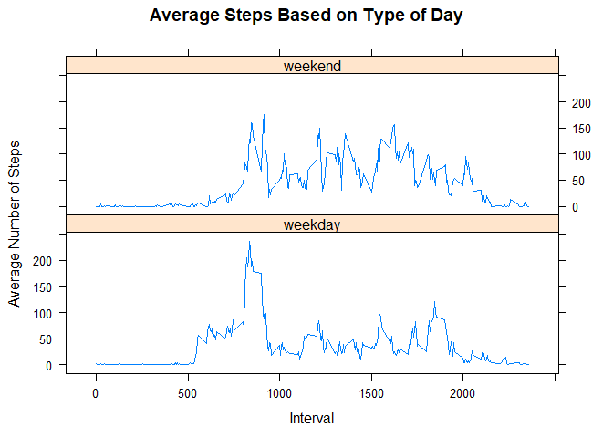

## Loading and preprocessing the data

```r
#Packages needed
library(plyr)
```

```
## Warning: package 'plyr' was built under R version 3.5.1
```

```r
library(lattice)

# Clear the workspace, set working directory
rm(list=ls())
setwd("C:/Users/jvroegop/Documents/Coursera/Course 5")
```

# Load the raw activity data

```r
activity_raw <- read.csv("activity.csv", stringsAsFactors=FALSE)

# Transform the date attribute to an actual date format
activity_raw$date <- as.POSIXct(activity_raw$date, format="%Y-%m-%d")

# Compute the weekdays from the date attribute
activity_raw <- data.frame(date=activity_raw$date, 
                           weekday=tolower(weekdays(activity_raw$date)), 
                           steps=activity_raw$steps, 
                           interval=activity_raw$interval)

# Compute the day type (weekend or weekday)
activity_raw <- cbind(activity_raw, 
                      daytype=ifelse(activity_raw$weekday == "zaterdag" | 
                                     activity_raw$weekday == "zondag", "weekend", 
                                     "weekday"))

# Create the final data.frame
activity <- data.frame(date=activity_raw$date, 
                       weekday=activity_raw$weekday, 
                       daytype=activity_raw$daytype, 
                       interval=activity_raw$interval,
                       steps=activity_raw$steps)

# Clear the workspace
rm(activity_raw)
```

## What is mean total number of steps taken per day?

```r
# Compute the total number of steps each day (NA values removed)
sum_data <- aggregate(activity$steps, by=list(activity$date), FUN=sum, na.rm=TRUE)

# Rename the attributes
names(sum_data) <- c("date", "total")
head(sum_data)
```

```
##         date total
## 1 2012-10-01     0
## 2 2012-10-02   126
## 3 2012-10-03 11352
## 4 2012-10-04 12116
## 5 2012-10-05 13294
## 6 2012-10-06 15420
```

```r
# Compute the histogram of the total number of steps each day
hist(sum_data$total, 
     breaks=seq(0,25000,2500),
     xlab="Total number of steps", 
     ylim=c(0, 20), 
     main="Total number of steps per day (NA removed)")
```

<!-- -->

```r
mean(sum_data$total)
```

```
## [1] 9354.23
```

```r
median(sum_data$total)
```

```
## [1] 10395
```
With NAs removed, the `mean` is 9354.2295082 and the `median` is 10395.

## What is the average daily activity pattern?

```r
# Compute the means of steps accross all days for each interval
mean_data <- aggregate(activity$steps, 
                       by=list(activity$interval), 
                       FUN=mean, 
                       na.rm=TRUE)

# Rename the attributes
names(mean_data) <- c("interval", "mean")
head(mean_data)
```

```
##   interval      mean
## 1        0 1.7169811
## 2        5 0.3396226
## 3       10 0.1320755
## 4       15 0.1509434
## 5       20 0.0754717
## 6       25 2.0943396
```

```r
# Compute the time series plot
plot(mean_data$interval, 
     mean_data$mean, 
     type="l", 
     col="blue", 
     lwd=2, 
     xlab="Interval (time of the day)", 
     ylab="Average number of steps", 
     main="Time-series of the average number of steps per interval")
```

<!-- -->

```r
# We find the position of the maximum mean
max_pos <- which(mean_data$mean == max(mean_data$mean))

# We lookup the value of interval at this position
max_interval <- mean_data[max_pos, 1]
```
Interval 835 has the highest mean.

## Imputing missing values

```r
# We use the trick that a TRUE boolean value is equivalent to 1 and a FALSE to 0.
NA_count <- sum(is.na(activity$steps))

# Create a vector of means
library(plyr)
mean_vec <- ddply(activity, .(interval, weekday), summarize, Avg = mean(steps, na.rm=TRUE))

activity <- merge(activity, mean_vec, by=c("interval","weekday"))
activity$steps[is.na(activity$steps)] <- activity$Avg[is.na(activity$steps)]
activity <- activity[,-6]

sum_data <- aggregate(activity$steps, by=list(activity$date), FUN=sum)

# Rename the attributes
names(sum_data) <- c("date", "total")

# Compute the histogram of the total number of steps each day
hist(sum_data$total, 
     breaks=seq(from=0, to=25000, by=2500),
     xlab="Total number of steps", 
     ylim=c(0, 25), 
     main="Total number of steps taken each day\n(NA replaced by mean value)")
```

<!-- -->

```r
mean(sum_data$total)
```

```
## [1] 10821.21
```

```r
median(sum_data$total)
```

```
## [1] 11015
```
With NAs replaced by averages (per interval per day of week), the mean is 1.082121\times 10^{4} and median is 1.1015\times 10^{4}.

## Are there differences in activity patterns between weekdays and weekends?

```r
## Summarize data by interval and type of day
intervalTable <- ddply(activity, .(interval, daytype), summarize, avg = mean(steps))

library(lattice)
##Plot data in a panel plot
xyplot(avg~interval|daytype, data=intervalTable, type="l",  layout = c(1,2),
       main="Average Steps Based on Type of Day", 
       ylab="Average Number of Steps", xlab="Interval")
```

<!-- -->
